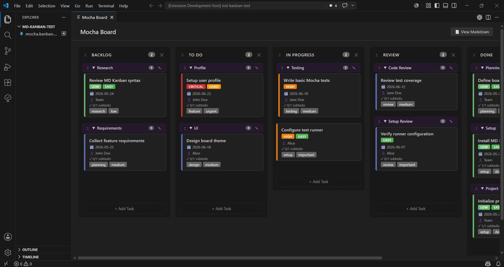
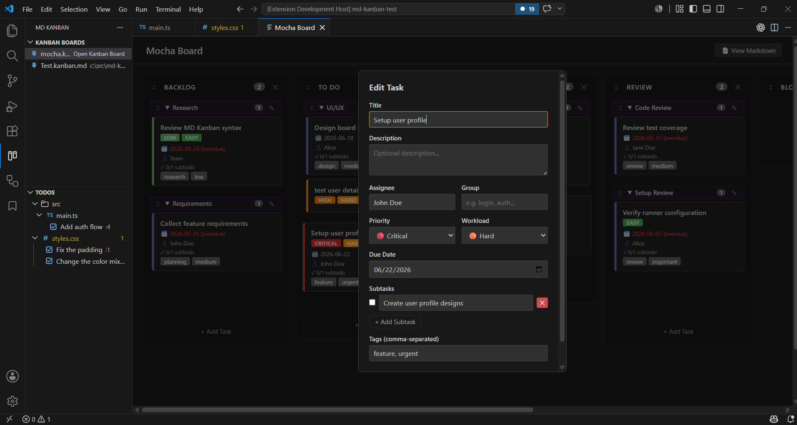
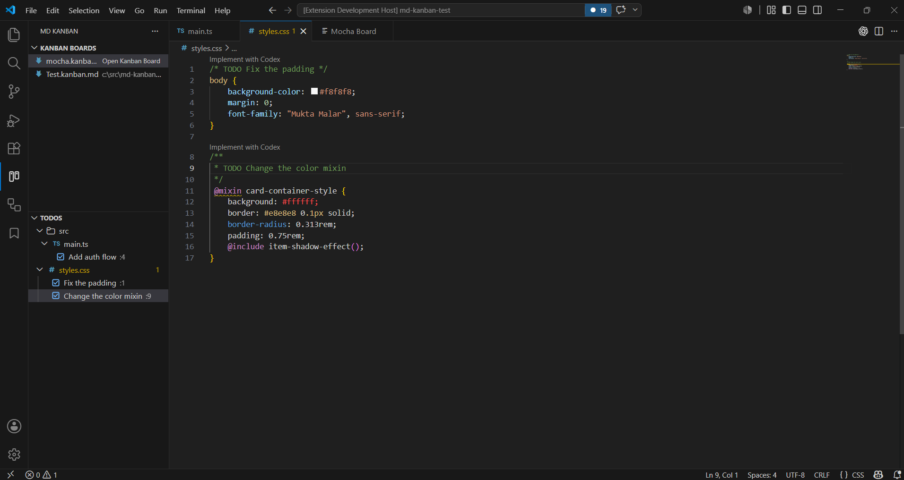

# MD Kanban

MD Kanban is a VS Code extension for managing tasks in a visual Kanban board while keeping the source of truth in plain Markdown.

Use it when you want a lightweight project board that lives with your code, works well with Git, and does not require an external service.


## Showcase

### Board View



### Add Task



### TODO View



### Calendar And Overdue View


### Timeline View


## Why MD Kanban?

- **Local-first** - Your board is stored in `.kanban.md` or `kanban.md` files in your workspace.
- **Git-friendly** - Tasks are readable Markdown, so changes can be reviewed, diffed, and versioned.
- **No external account required** - Use a Kanban board without signing in to another service.
- **Visual when you want it, text when you need it** - Edit in the board UI or open the Markdown directly.
- **Built for VS Code workflows** - Manage project work without leaving the editor.
- **Project-aware** - Open boards, source TODOs, and overdue cards from the MD Kanban Activity Bar view.

## Features

- Visual Kanban board for `.kanban.md` and `kanban.md` files.
- MD Kanban Activity Bar view with board, TODO, overdue task, and calendar sections.
- Multiple boards per workspace; every `*.kanban.md` file and `kanban.md` file appears in the side panel.
- Board templates for Blank, Basic, Sprint, Bug Tracker, Release Checklist, and Personal workflows.
- Filter and search board cards by text, assignee, tag, priority, workload, and due date.
- Board statistics for card counts, readable per-column chips, overdue cards, workload points, and subtask completion.
- Overdue Tasks side-panel view for cards with past due dates.
- Calendar side-panel view with a compact month grid, date dots, task counts, and a collapsible timeline tree.
- Archive individual cards into a workspace `archive.kanban.md` board.
- Drag cards between columns, within columns, into groups, out of groups, and to the end of a column.
- Card-sized drop indicators that show exactly where a card will land.
- Collapsible task groups backed by Markdown `###` headings.
- Rename groups with a modal; all cards in that group are updated together.
- Move whole groups with drag-and-drop.
- Add, rename, reorder, and delete columns.
- Task fields for description, tags, priority, workload, due date, assignee, and subtasks.
- Task templates for quickly starting bug, feature, release, and personal cards.
- Source metadata links cards back to files and line numbers.
- Explorer-style TODO tree for configured source comment keywords such as `TODO`, `FIXME`, `BUG`, `HACK`, and `NOTE`.
- Add source TODO comments to a board as cards with source file and line details.
- Priority strips, workload badges, overdue highlighting, and subtask progress.
- VS Code theme integration.
- File watching for changes made outside the visual board.
- Side-by-side raw Markdown view.

## Installation

### From the VS Code Marketplace

Install **MD Kanban** from the Visual Studio Marketplace once published, then run the commands below from the Command Palette.

### From a VSIX

If you have a packaged `.vsix` file:

1. Open VS Code.
2. Run **Extensions: Install from VSIX...**.
3. Select the `.vsix` file.

## Quick Start

1. Open the **MD Kanban** icon in the Activity Bar.
2. Click **Create New Kanban Board** in the **Kanban Boards** section.
3. Enter a board name and select your template. A `.kanban.md` file is created in your workspace.
4. Click any board in the side panel to open it.
5. Add tasks and drag cards around the board.

| Command | Description |
| --- | --- |
| `Kanban: Create New Kanban Board` | Create a new `.kanban.md` file from a board template |
| `Kanban: Open Kanban Board` | Pick and open an existing `.kanban.md`, `kanban.md`, or `.kanban.md` file as a Kanban board |
| `Kanban: Refresh Kanban Boards` | Refresh the board list in the MD Kanban side panel |
| `Kanban: Refresh TODOs` | Refresh the source TODO list in the MD Kanban side panel |
| `Kanban: Show Overdue Tasks` | Focus the Overdue Tasks side-panel view |
| `Kanban: Refresh Overdue Tasks` | Refresh overdue cards in the MD Kanban side panel |
| `Kanban: Show Timeline` | Show the collapsible timeline tree inside the Calendar side-panel view |
| `Kanban: Refresh Timeline` | Refresh upcoming due cards used by the timeline tree |
| `Kanban: Show Calendar` | Focus the Calendar side-panel view |
| `Kanban: Refresh Calendar` | Refresh dated cards in the MD Kanban side panel |

You can keep more than one board in a workspace. Files such as `frontend.kanban.md`, `backend.kanban.md`, and `release.kanban.md` are listed as separate boards.

Board files also have an **Open Kanban Board** action in the Explorer and editor title context menus. TODO items have an inline add icon in the TODO side panel; that action is not shown as a Command Palette command.

## Using the Board

### Tasks

- Click **+ Add Task** in a column to create a card.
- Choose a task template to prefill common fields like title, tags, priority, workload, assignee, and subtasks.
- Click a card to open its details in the center of the board.
- Source-linked cards show a small source button that opens the referenced file and line.
- Use card action buttons to edit, archive, delete, or open source when available.
- Archive actions use an orange archive button; delete actions use a red trash button.
- In the card details view, use Edit, Open Source, Archive, or Delete; close the view with the top-right `X`.
- Add title, description, tags, priority, workload, due date, assignee, group, and subtasks.
- Archive and delete actions ask for confirmation, with an option to stop asking again for that action.
- Drag cards to reorder them or move them between columns and groups.
- Use the blue dashed drop indicator to see where the card will land.

### Summary And Filters

- Use the summary bar to scan total cards, per-column count chips, overdue cards, workload points, and completed subtasks.
- Workload points summarize estimated effort: easy = 1, normal = 2, hard = 3, extreme = 5.
- Use the board filter bar to search card text and narrow cards by assignee, tag, priority, workload, or due date.
- Use quick chips for overdue, high-priority, and hard-workload cards.
- Card counts live in the summary bar; the filter bar stays focused on filtering controls.
- Clear active filters to return to the full board.

### Overdue Tasks

- The **Overdue Tasks** side-panel view groups overdue cards by due date.
- Cards are overdue when their `due` date is before today.
- Completed-style columns are skipped. Default completed column globs are `Done`, `Closed`, `Shipped`, and `Archived`.
- Configure completed column name globs with `mdKanban.completedColumnGlobs`; `*` and `?` wildcards are supported.
- Click an overdue card to open its source Kanban board and show the card details view.
- Run **Kanban: Show Overdue Tasks** to focus the reminder list.

Example completed column settings: 

```json
{
  "mdKanban.completedColumnGlobs": ["Done", "Closed", "Shipped", "Archived", "QA Done", "Released *"]
}
```
Note: Add a `.vscode/settings.json` file in the project:

### Calendar

- The **Calendar** side-panel view shows a compact month grid with dates.
- Date cells show only the date, a dot, and task count; dates with overdue cards use a warning-colored dot.
- Click a date cell to open the first card on that date in the source Kanban board and show the card details view.
- Use previous, next, and the icon-only Today button to move through months.
- Use the view-title switcher next to refresh to switch between Calendar and Timeline modes; the icon changes with the target mode.
- Timeline mode shows upcoming cards in collapsible tree groups for `Today`, `This Week`, `Next Week`, and `Later`.
- `This Week` and `Next Week` use calendar weeks that start on Monday.
- Overdue cards stay in the **Overdue Tasks** view instead of timeline mode.
- Completed-style columns are skipped using the same `mdKanban.completedColumnGlobs` setting as overdue and timeline scanning.
- Run **Kanban: Show Calendar** to focus the calendar grid.


### Groups

- Tasks under a `###` heading belong to that group.
- Click a group header to collapse or expand it.
- Click the group edit icon to rename a group.
- Use the group drag handle (`::`) to move a whole group.
- Drop cards into a group to assign them.
- Drop cards into the ungrouped area or column end to remove them from a group.

### Columns

- When creating a board, choose a template: Blank, Basic, Sprint, Bug Tracker, Release Checklist, or Personal.
- The Blank template creates an empty board with no columns; use **+ Add Column** to build it from scratch.
- Click **+ Add Column** to create a column.
- Click a column title to rename it.
- Use the column drag handle (`::`) to reorder columns.
- Use the delete icon to remove a column and its tasks.

### Default Templates

Board templates define the initial columns for a new `.kanban.md` file:

| Template | Default columns |
| --- | --- |
| Blank | No columns |
| Basic | `To Do`, `In Progress`, `Done` |
| Sprint | `Backlog`, `Ready`, `In Progress`, `Review`, `Done` |
| Bug Tracker | `Triage`, `Confirmed`, `In Progress`, `Verify`, `Closed` |
| Release Checklist | `Planned`, `In Progress`, `Blocked`, `Ready`, `Shipped` |
| Personal | `Today`, `This Week`, `Waiting`, `Done` |

Task templates prefill common card fields when adding a task:

| Template | Title | Tags | Priority | Workload | Default subtasks |
| --- | --- | --- | --- | --- | --- |
| Blank | Empty | None | `medium` | `normal` | None |
| Bug | `Investigate bug` | `bug` | `high` | `normal` | Reproduce the issue; Identify root cause; Add regression coverage |
| Feature | `Build feature` | `feature` | `medium` | `hard` | Define acceptance criteria; Implement changes; Update docs or tests |
| Release | `Prepare release item` | `release` | `high` | `normal` | Verify build; Update changelog; Confirm rollback notes |
| Personal | `Personal task` | `personal` | `medium` | `easy` | Define next action |

### Markdown View

- Click **View Markdown** to open the raw board file beside the visual board.
- Manual Markdown edits are picked up by the board when the file changes.

### Archive

- Use the orange archive button on a card or in the card details view to move that card into `archive.kanban.md`.
- If `archive.kanban.md` does not exist beside the source board, MD Kanban creates it automatically.
- If `archive.kanban.md` already exists, MD Kanban updates it in place.
- Archived cards are appended to a column named after the source board file, such as `plan.kanban.md`.
- Future cards archived from the same board are appended to that same source-file column.
- The archived card is removed from the source board after it is written to the archive board.
- Cards already inside `archive.kanban.md` cannot be archived again; open the archive board to review or delete them.
- Archiving keeps older work in Markdown history without cluttering the active board.

### TODOs

- In the MD Kanban side panel, the **TODOs** section scans the workspace for configured source comment keywords.
- TODOs are grouped by folder and file. Folders and files expand and collapse like the Explorer.
- File rows use the active VS Code file icon theme. TODO rows use a checked icon and show the line number at the row end.
- Click a TODO item to open the source file at the matching line.
- Click the add icon on a TODO item to add it as a Kanban card.
- Choose the target board and column; MD Kanban creates a card with the TODO title, `todo` tag, `source` metadata, backlink, and original TODO text.
- TODOs are separate from `.kanban.md` boards. Edit or remove the original source comment to update them.
- Configure scanned files and keywords with `mdKanban.todoInclude`, `mdKanban.todoExclude`, and `mdKanban.todoKeywords`.
- Keyword matching is case-insensitive, so `todo`, `Todo`, and `TODO` all match the same configured keyword.
- Very large files over 1 MB and files that look binary are skipped to keep the side panel responsive.

Supported TODO comment styles:

```txt
// TODO Add validation
// FIXME Handle retry failures
// BUG Wrong total after filter reset
// HACK Remove temporary parser fallback
// NOTE Document release checklist
const value = 1; // TODO Handle inline comments
# TODO Add validation
name=value # TODO Handle inline properties comments
! TODO Add validation
; TODO Add validation
;; TODO Add validation
SELECT 1 -- TODO Add validation
REM TODO Add validation
' TODO Add validation
% TODO Add validation
<!-- TODO Add validation -->
/* TODO Add validation */
/**
 * TODO Add validation
 */
```

Supported prefixes include `//`, `#`, `!`, `;`, `;;`, `--`, `REM`, `'`, `%`, `<!-- -->`, `/* */`, and `*` doc-comment lines. These cover common styles in JavaScript/TypeScript, C-like languages, shell, Python, Ruby, YAML, `.properties`, INI/config files, SQL, Lua, Haskell, HTML/XML/Markdown, Windows batch, VB/VBA, MATLAB, LaTeX, Lisp, and Clojure.

Comment style examples:

| Prefix | Common file types |
| --- | --- |
| `// TODO` | JavaScript, TypeScript, Java, C, C++, C#, Go, Rust |
| `# TODO` | Shell, Python, Ruby, YAML, `.properties` |
| `! TODO` | `.properties` |
| `; TODO`, `;; TODO` | INI/config, Lisp, Clojure |
| `-- TODO` | SQL, Lua, Haskell |
| `<!-- TODO -->` | HTML, XML, Markdown |
| `REM TODO` | Windows batch |
| `' TODO` | VB, VBA |
| `% TODO` | MATLAB, LaTeX |
| `/* TODO */`, `* TODO` | Block and doc comments |

Use workspace settings to control scanning per project. Add a `.vscode/settings.json` file in the project:

```json
{
  "mdKanban.todoKeywords": ["TODO", "FIXME", "BUG"],
  "mdKanban.todoExclude": [
    "**/dist/**",
    "**/node_modules/**",
    "**/generated/**"
  ],
  "mdKanban.todoInclude": [
    "src/**/*.ts",
    "tests/**/*.ts"
  ],
  "mdKanban.completedColumnGlobs": [
    "Done",
    "Closed",
    "Released *"
  ]
}
```

Workspace settings apply only to that project and override user-level defaults.

Troubleshooting TODO scanning:

- Use **Kanban: Refresh TODOs** after changing settings or editing files.
- Make sure the file matches `mdKanban.todoInclude` and is not matched by `mdKanban.todoExclude`.
- Check that the keyword is listed in `mdKanban.todoKeywords`.
- Use one of the supported comment prefixes above; plain text like `TODO fix this` is not shown.
- Files larger than 1 MB and likely binary files are skipped.

## Markdown Format

Board data is stored in plain Markdown. You can edit it manually or through the visual board.

```markdown
# My Project Board

## To Do

#### Set up database migrations
<!-- id: task-1770000000000-0 -->
Create migration scripts for PostgreSQL schema changes.
- [x] Design schema
- [ ] Write migration files
- [ ] Add rollback scripts
Tags: `backend` `database`
<!-- priority: high -->
<!-- workload: hard -->
<!-- due: 2026-04-01 -->
<!-- assignee: Alice -->
<!-- source: src/db/migrations.ts:42 -->

### Sprint 1

#### Implement user auth
<!-- id: task-1770000000000-1 -->
Add OAuth2 support for Google and GitHub.
Tags: `feature` `auth`
<!-- priority: critical -->
<!-- assignee: Bob -->

#### Ungrouped task after a group
<!-- id: task-1770000000000-2 -->
<!-- group: -->
This task is explicitly ungrouped even though it appears after a group heading.
```

### Headings

| Heading | Meaning |
| --- | --- |
| `#` | Board title |
| `##` | Column |
| `###` | Task group |
| `####` | Task |

### Board Metadata

Board-level metadata is stored as HTML comments near the top of the file.

| Comment | Values |
| --- | --- |
| `<!-- empty-board: true -->` | Keeps Blank template boards empty when they have no columns |

### Task Metadata

Metadata is stored as HTML comments under a task.

| Comment | Values |
| --- | --- |
| `<!-- id: VALUE -->` | Stable task ID generated by MD Kanban |
| `<!-- priority: VALUE -->` | `critical`, `high`, `medium`, `low` |
| `<!-- workload: VALUE -->` | `easy`, `normal`, `hard`, `extreme` |
| `<!-- due: YYYY-MM-DD -->` | Any valid date |
| `<!-- assignee: NAME -->` | Free text |
| `<!-- source: PATH:LINE -->` | Source file and line, for example `src/foo.ts:42` |
| `<!-- group: NAME -->` | Explicit group assignment |
| `<!-- group: -->` | Explicitly mark a task as ungrouped |

Other supported task content:

- **Description**: Plain text below the task heading.
- **Subtasks**: `- [x] Done item` / `- [ ] Pending item`.
- **Tags**: `Tags: \`tag-name\` \`another-tag\``.

## Privacy

MD Kanban stores board data in local Markdown files in your workspace. It does not require an account or send your task data to an external service.

## Contributing

Contributions are welcome. If you find a bug or have an idea, please open an issue or pull request in the repository.

### Development Setup

```bash
git clone https://github.com/jebakumarj/md-kanban.git
cd md-kanban
npm install
npm run compile
```

Press **F5** in VS Code to launch an Extension Development Host.

## Requirements

- VS Code 1.109 or newer.
- Node.js 16 or newer for local development.

## License

MIT

Co-authored with Codex
